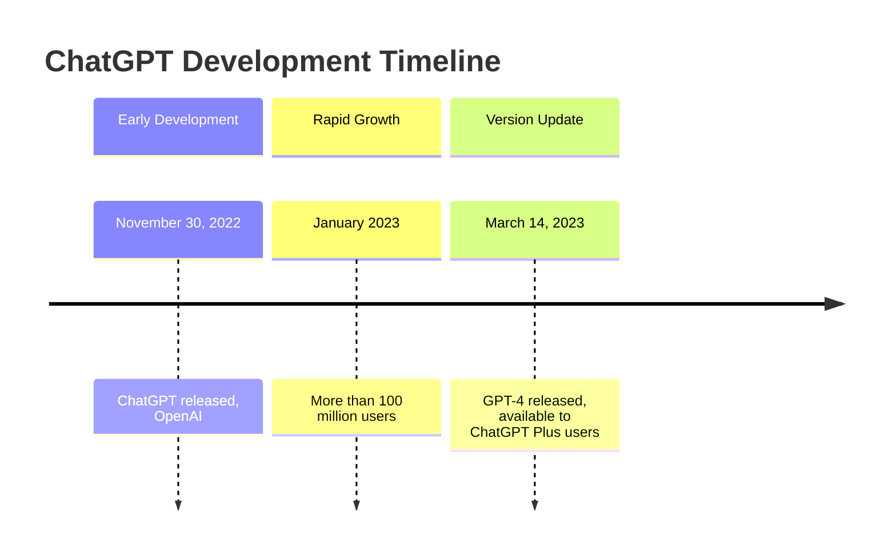
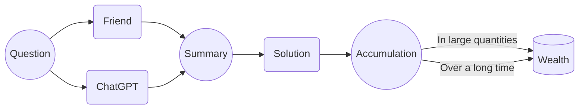

# What Markdown Can Do

Markdown makes formatting easier. [Playground link](/playground/), [Webpage link](/guide/).

> Playground won't save your change.

## What Specifically Can It Do?

- [x] Implement a simple to-do list
- [x] Common paragraph formats: normal paragraphs, six levels of headings, block quotes, lists, to-dos, code, tables, formulas, footnotes, dividers, images, etc.
- [x] Common inline formats: **bold**, *italic*, ~~strikethrough~~, [link🔗](), 🤣emoji, inline formula $e^\pi$, inline code `a = 3`...
- [ ] ~~Get some fries at the dock~~

## Markdown Can Do More

- [x] Various charts, such as flowcharts, mind maps, Gantt charts, timelines, etc. Find it troublesome? Try [letting ChatGPT do it](/reference/chatgpt/).[^1]
- [ ] PPT
- [x] Music scores (generally not supported by Markdown applications)
- [x] This website, see the [Website Building](#building-a-website) section
- [ ] ~~Go to Mars~~

### Timeline



### Flowchart


### Music Score

> Write by ChatGPT, maybe wrong.

```abc
X:1
T:Ode to Joy
C:Ludwig van Beethoven
M:4/4
L:1/4
K:C
"G"G3/2A/2 G E G | "D7"F3/2E/2 F D F | "G"G3G G A | B3/2A/2 G E G |
"D7"F3/2E/2 F E D | "G"G3G G A | B3/2A/2 G E G | "D7"F3/2E/2 F D F | "G"G3z ||

```

## More Things If You Are a Programmer

### HTML

- <u>Underline</u>
- iframe
- svg
- Create a button

### CSS

Markdown ultimately renders as HTML, and CSS can modify the layout of HTML elements. If your Markdown editing software has the corresponding configuration, you might be able to:

- Define CSS inline
- Customize CSS globally

### Building a Website

You can deploy this site by clicking this button:

[](https://vercel.com/import/project?template=https://github.com/gantrol/markdown-can-do)

There are many ways to build websites based on Markdown. Personal research has mainly identified Vitepress and MDX as two options, both extending Markdown and allowing for code component insertion. Vitepress primarily supports Vue components, while MDX mainly supports React components.

Considering performance and maintenance stability, this site is built with Vitepress, and the site owner learned Vue overnight (~~in one hour~~).

## Want More?

You might want to check out the [reference materials](/reference-resource) or ask ChatGPT？


[^1]: Find it difficult? Actually, there's no need to memorize the syntax for various charts. The site owner used to rely on manuals, but now mainly consults ChatGPT.
