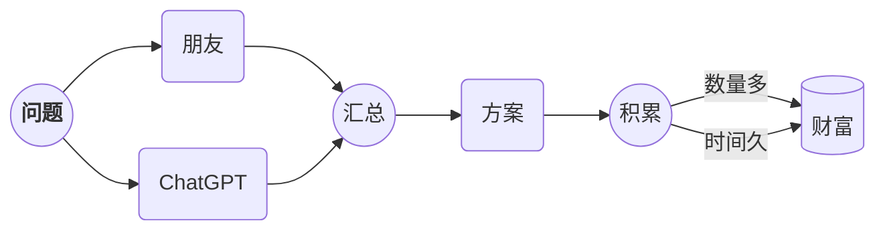

# Markdown Can Do More[^1]

- [x] 简单的待办实现清单
- [ ] list syntax required
- [ ] diagramming and charting
- [ ] ~~上火星~~

$$
\mathbf{V}_1 \times \mathbf{V}_2 =  \begin{vmatrix}
\mathbf{i} & \mathbf{j} & \mathbf{k} \\
\frac{\partial X}{\partial u} &  \frac{\partial Y}{\partial u} & 0 \\
\frac{\partial X}{\partial v} &  \frac{\partial Y}{\partial v} & 0 \\
\end{vmatrix}
$$

[^1]: Most of these examples written by ChatGPT
