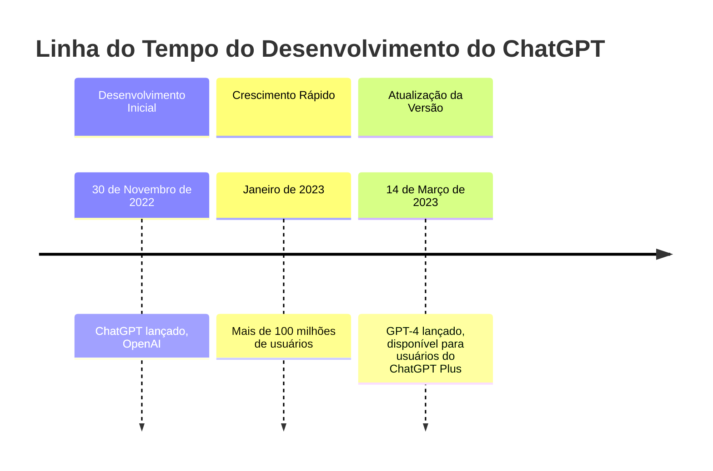
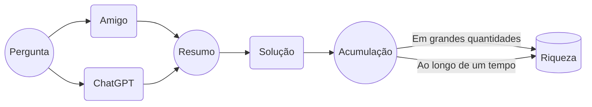

# O que o Markdown Pode Fazer

Markdown torna a formatação mais fácil. [Link do Playground](/playground/), [Link da página da web](/guide/).

> Playground não salvará sua alteração.

## O que Especificamente Ele Pode Fazer?

- [x] Implementar uma lista de tarefas simples
- [x] Formatos comuns de parágrafo: parágrafos normais, seis níveis de títulos, citações em bloco, listas, tarefas, código, tabelas, fórmulas, notas de rodapé, divisores, imagens, etc.
- [x] Formatos inline comuns: **negrito**, *itálico*, ~~tachado~~, [link🔗](), 🤣emoji, fórmula inline $e^\pi$, código inline `a = 3`...
- [ ] ~~Pegar algumas batatas fritas no cais~~

## Markdown Pode Fazer Mais

- [x] Vários gráficos, como fluxogramas, mapas mentais, gráficos de Gantt, linhas do tempo, etc. Acha isso problemático? Tente [deixar o ChatGPT fazer isso](/reference/chatgpt/).[^1]
- [ ] PPT
- [x] Partituras musicais (geralmente não suportadas por aplicativos Markdown)
- [x] Este site, veja a seção [Construindo um Site](#construindo-um-site)
- [ ] ~~Ir para Marte~~

### Linha do Tempo



### Fluxograma


### Partitura Musical

> Escrito pelo ChatGPT, pode estar errado.

```abc
X:1
T:Ode à Alegria
C:Ludwig van Beethoven
M:4/4
L:1/4
K:C
"G"G3/2A/2 G E G | "D7"F3/2E/2 F D F | "G"G3G G A | B3/2A/2 G E G |
"D7"F3/2E/2 F E D | "G"G3G G A | B3/2A/2 G E G | "D7"F3/2E/2 F D F | "G"G3z ||

```

## Mais Coisas Se Você For um Programador

### HTML

- <u>Sublinhado</u>
- iframe
- svg
- Criar um botão

### CSS

Markdown acaba renderizando como HTML, e CSS pode modificar o layout dos elementos HTML. Se o seu software de edição Markdown tem a configuração correspondente, você pode ser capaz de:

- Definir CSS inline
- Personalizar CSS globalmente

### Construindo um Site

Você pode implantar este site clicando neste botão:

[](https://vercel.com/import/project?template=https://github.com/gantrol/markdown-can-do)

Existem muitas maneiras de construir sites baseados em Markdown. Pesquisas pessoais identificaram principalmente Vitepress e MDX como duas opções, ambas extendendo Markdown e permitindo a inserção de componentes de código. Vitepress suporta principalmente componentes Vue, enquanto MDX suporta principalmente componentes React.

Considerando desempenho e estabilidade de manutenção, este site é construído com Vitepress, e o dono do site aprendeu Vue da noite para o dia (~~em uma hora~~).

## Quer Mais?

Você pode querer conferir os [materiais de referência](/reference/resource) ou perguntar ao ChatGPT？


[^1]: Acha difícil? Na verdade, não há necessidade de memorizar a sintaxe para vários gráficos. O proprietário do site costumava depender de manuais, mas agora consulta principalmente o ChatGPT.
