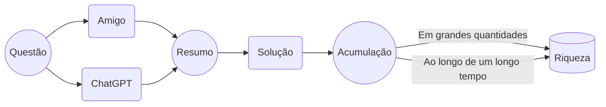

```mermaid
flowchart LR
A(("Questão")) --> B(Amigo)
A --> ChatGPT(ChatGPT)
B --> sum((Resumo))
ChatGPT --> sum
sum --> solution(Solução)
solution --> accu((Acumulação))
accu -->|Em grandes quantidades| Wealth[(Riqueza)]
accu -->|Ao longo de um longo tempo| Wealth
```
