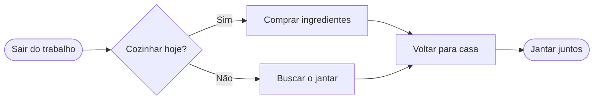

```mermaid
flowchart LR
  A([Sair do trabalho]) --> B{Cozinhar hoje?}
  B -->|Sim| C[Comprar ingredientes]
  B -->|Não| D[Buscar o jantar]
  C --> E[Voltar para casa]
  D --> E
  E --> F([Jantar juntos])
```
