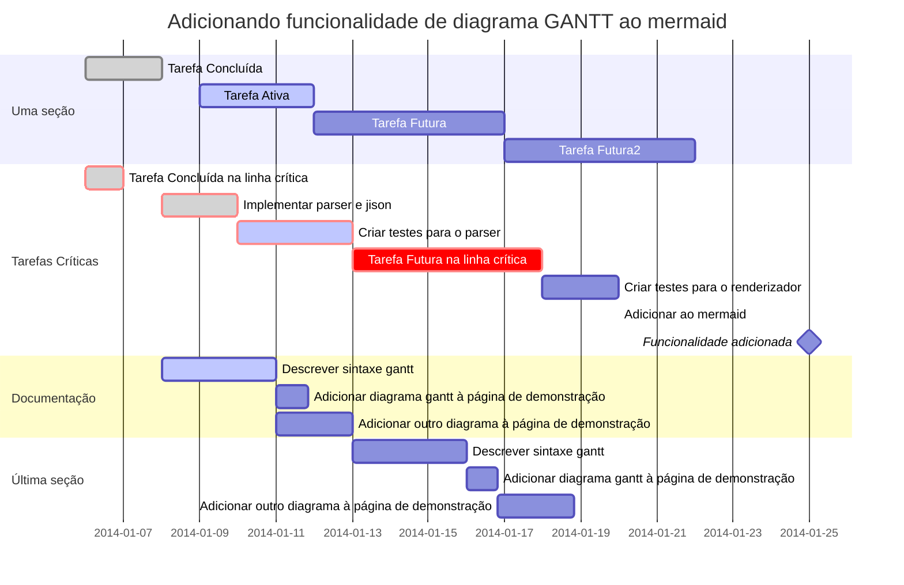

# Diagramas de Gantt

## Sintaxe

Citação de [memaid.js](https://mermaid.js.org/syntax/gantt.html#syntax)

```mermaid
gantt
    dateFormat  YYYY-MM-DD
    title       Adicionando funcionalidade de diagrama GANTT ao mermaid
    excludes    finais de semana
    %% (`excludes` aceita datas específicas no formato AAAA-MM-DD, dias da semana ("domingo") ou "finais de semana", mas não a palavra "dias úteis".)

    section Uma seção
    Tarefa Concluída            :done,    des1, 2014-01-06,2014-01-08
    Tarefa Ativa                :active,  des2, 2014-01-09, 3d
    Tarefa Futura               :         des3, after des2, 5d
    Tarefa Futura2              :         des4, after des3, 5d

    section Tarefas Críticas
    Tarefa Concluída na linha crítica :crit, done, 2014-01-06,24h
    Implementar parser e jison          :crit, done, after des1, 2d
    Criar testes para o parser             :crit, active, 3d
    Tarefa Futura na linha crítica        :crit, 5d
    Criar testes para o renderizador           :2d
    Adicionar ao mermaid                      :até isadded
    Funcionalidade adicionada                 :milestone, isadded, 2014-01-25, 0d

    section Documentação
    Descrever sintaxe gantt               :active, a1, after des1, 3d
    Adicionar diagrama gantt à página de demonstração      :after a1  , 20h
    Adicionar outro diagrama à página de demonstração    :doc1, after a1  , 48h

    section Última seção
    Descrever sintaxe gantt               :after doc1, 3d
    Adicionar diagrama gantt à página de demonstração      :20h
    Adicionar outro diagrama à página de demonstração    :48h
```
