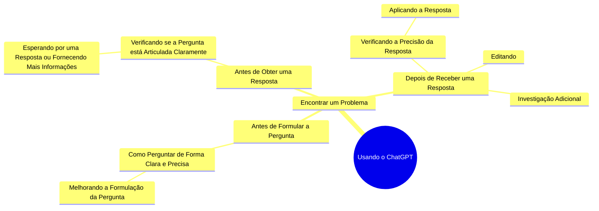

```mermaid
mindmap
  root((Usando o ChatGPT))
    Encontrar um Problema
      Antes de Formular a Pergunta
        Como Perguntar de Forma Clara e Precisa
          Melhorando a Formulação da Pergunta
      Antes de Obter uma Resposta
        Verificando se a Pergunta está Articulada Claramente
          Esperando por uma Resposta ou Fornecendo Mais Informações
      Depois de Receber uma Resposta
        Verificando a Precisão da Resposta
          Aplicando a Resposta
        Investigação Adicional
        Editando
```
