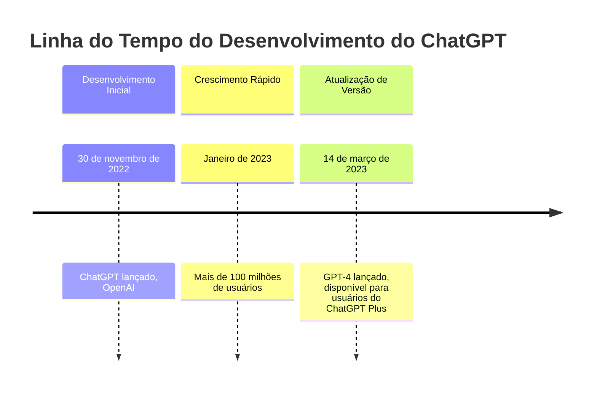

```mermaid
timeline
    title Linha do Tempo do Desenvolvimento do ChatGPT
    section Desenvolvimento Inicial
        30 de novembro de 2022 : ChatGPT lançado, OpenAI
    section Crescimento Rápido
        Janeiro de 2023 : Mais de 100 milhões de usuários
    section Atualização de Versão
        14 de março de 2023 : GPT-4 lançado, disponível para usuários do ChatGPT Plus
```

Mais: [Diagrama de Linha do Tempo | Mermaid.js](https://mermaid.js.org/syntax/timeline.html)
