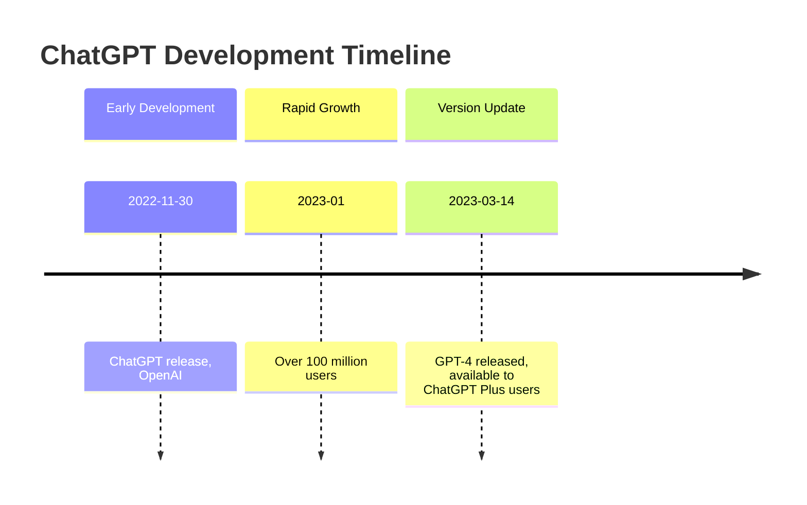

# Have ChatGPT Write Markdown

## Let It Write Everything

For instance, a TimeLine on this site was written by ChatGPT as follows:

```markdown
Refer to https://en.wikipedia.org/wiki/ChatGPT
Use mermaid timeline
to draw the development history of ChatGPT
```

GPT's output:

````markdown

````

The MermaidChart even launched an [official Plugin](https://www.mermaidchart.com/blog/posts/mermaid-chart-chatgpt-plugin-combines-generative-ai-and-smart-diagramming)

[//]: # (TODO: GPTs)

## Optimize Formatting

Feed GPTs with well-written standards, such as [Ruan Yifeng's "Chinese Technical Documentation Writing Standards"](https://github.com/ruanyf/document-style-guide).

[//]: # (TODO: GPTs)

If you like using social platforms, you might find that users like using emojis, which can be added to articles appropriately.

[//]: # (TODO: GPTs to add suitable emojis to articles)

### Prompt Replacement

Of course, if you don't have a ChatGPT membership, **you can substitute it with prompts**. For recommended AIs, refer to [this link](https://www.gantrol.com/AI/TOP1.html).

[//]: # (TODO: Corresponding prompts, directly imported from a file, folded)
