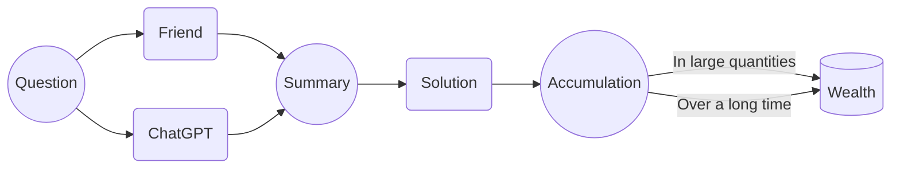

```mermaid
flowchart LR
A(("Question")) --> B(Friend)
A --> ChatGPT(ChatGPT)
B --> sum((Summary))
ChatGPT --> sum
sum --> solution(Solution)
solution --> accu((Accumulation))
accu -->|In large quantities| Wealth[(Wealth)]
accu -->|Over a long time| Wealth
```
