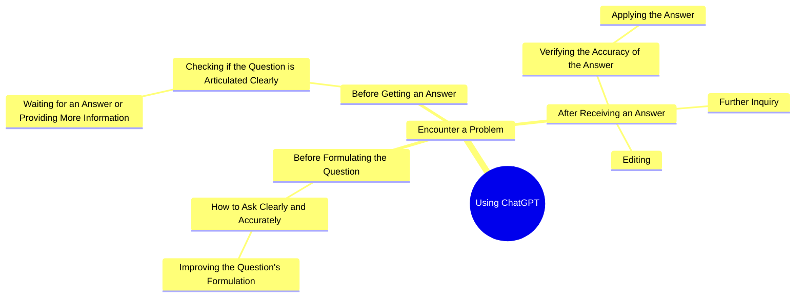

```mermaid
mindmap
  root((Using ChatGPT))
    Encounter a Problem
      Before Formulating the Question
        How to Ask Clearly and Accurately
          Improving the Question's Formulation
      Before Getting an Answer
        Checking if the Question is Articulated Clearly
          Waiting for an Answer or Providing More Information
      After Receiving an Answer
        Verifying the Accuracy of the Answer
          Applying the Answer
        Further Inquiry
        Editing

```
