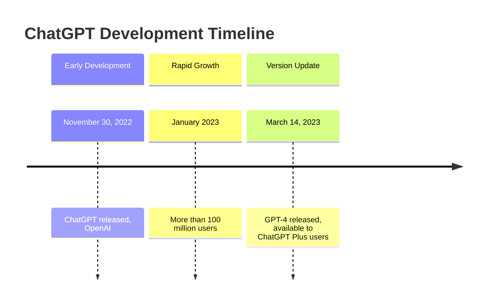

```mermaid
timeline
    title ChatGPT Development Timeline
    section Early Development
        November 30, 2022 : ChatGPT released, OpenAI
    section Rapid Growth
        January 2023 : More than 100 million users
    section Version Update
        March 14, 2023 : GPT-4 released, available to ChatGPT Plus users
```
