# Markdown 能做

Markdown 让排版更轻松。[在线演练场](/zh/playground/)能自由操作，也会有更多功能，[网页链接](/zh/guide/) 为静态文本。

> 演练场刷新页面后会复原，谨慎用来持续编辑

## 具体能做什么？

- [x] 简单的待办实现清单
- [x] 常用段落格式：普通段落、六级标题、段落引用、列表、待办、代码、表格、公式、脚注、分割线、图像……
- [x] 常用段内格式：**加粗**、*倾斜*、~~删除线~~、[链接🔗]()、🤣表情、段内公式$e^\pi$、段内代码`a = 3`……
- [x] 复制粘贴 Markdown 到公众号
- [ ] ~~去码头整点薯条~~

## 能做更多

- [x] 各类图表，如流程图、思维导图、甘特图、时间线等。觉得麻烦？试试[让 ChatGPT 来做](/zh/reference/chatgpt/)。[^1]
- [ ] PPT
- [x] 五线谱（一般 Markdown 应用不支持）
- [x] 这个网站，详见[建站](#建站)一节
- [ ] ~~上火星~~

### 时间线

```mermaid
timeline
    title ChatGPT发展历程
    section 早期开发
        2022年11月30日 : ChatGPT发布, OpenAI
    section 快速增长
        2023年1月 : 用户超过1亿
    section 版本更新
        2023年3月14日 : GPT-4发布, 提供给ChatGPT Plus用户
```



### 流程图

```mermaid
flowchart LR
A(("问题")) --> B(朋友)
A --> ChatGPT(ChatGPT)
B --> sum((汇总))
ChatGPT --> sum
sum --> solution(方案)
solution --> accu((积累))
accu -->|数量多| Wealth[(财富)]
accu -->|时间久| Wealth
```


### 五线谱

> ChatGPT 写的，可能有错

```abc
X:1
T:Ode to Joy
C:Ludwig van Beethoven
M:4/4
L:1/4
K:C
"G"G3/2A/2 G E G | "D7"F3/2E/2 F D F | "G"G3G G A | B3/2A/2 G E G |
"D7"F3/2E/2 F E D | "G"G3G G A | B3/2A/2 G E G | "D7"F3/2E/2 F D F | "G"G3z ||

```

## More Things If you are a programmer

### HTML

- <u>下划线</u>
- iframe
- svg
- 弄个按钮

### CSS

Markdown 最终会渲染为 HTML，而 CSS 可以修改 HTML 元素的排布。如果 Markdown 编辑软件有相应配置，你可能可以：

- 行内定义 CSS
- 全局自定义 CSS

### 建站

比如点击这个按钮，就在vercel部署这个网站。

[](https://vercel.com/import/project?template=https://github.com/gantrol/markdown-can-do)

有很多基于 Markdown 的建站方式，个人调研后发现主要是 Vitepress 跟 MDX 两种，它们都拓展了 Markdown，都能插入代码组件。Vitepress 主要支持 Vue 组件，MDX 主要支持 React 组件

出于性能、维护稳定性考虑，本站使用 Vitepress 构建，站长为此连夜学 Vue（~~一个小时~~）。

## 还想更多？

可以看看[参考资料](/zh/reference/resource)

或者问问 ChatGPT？


[^1]: 觉得难吗？其实不用记各类图表的语法，站长以前靠查手册，现在主要看 ChatGPT

