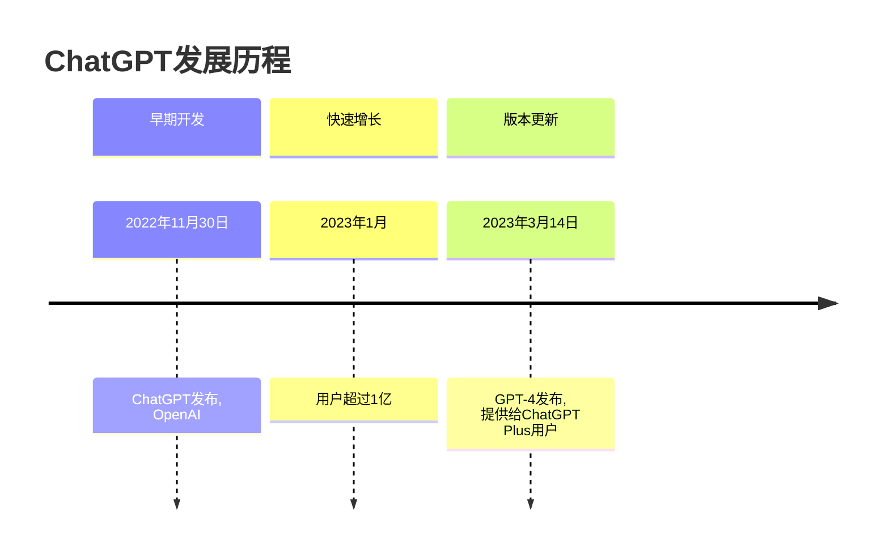

# Markdown 能做

Markdown 让排版更轻松

[toc]

- [x] 简单的待办实现清单
- [x] 常用段落格式：普通段落、六级标题、段落引用、列表、待办、代码、表格、公式、脚注、分割线、图像……
- [x] 常用段内格式：**加粗**、*倾斜*、~~删除线~~、[链接🔗]()、🤣表情、段内公式$e^\pi$、段内代码`a = 3`……
- [ ] ~~乌鸦坐飞机~~

## Markdown Can Do More

- [x] 各类图表，如流程图、思维导图、甘特图、时间线等。觉得麻烦？试试[让 ChatGPT 来做](/zh/reference/chatgpt/)[^1]
- [ ] PPT
- [ ] 五线谱（一般不支持）
- [x] 这个网站，详见[建站](#建站)一节
- [ ] ~~上火星~~

### 时间线



### 流程图


### 五线谱

```abc
X:1
T:Ode to Joy
M:4/4
L:1/4
K:C
E E F G | G F E D |
```

## More Things If you are a programmer

### HTML

- <u>下划线</u>
- `<video src=""/>`

### CSS

#### 行内

TODO

[//]: # (TODO)

#### 全局自定义

TODO

[//]: # (TODO)

### 建站

有很多基于 Markdown 的建站方式，个人调研后发现主要是 Vitepress 跟 MDX 两种，它们都拓展了 Markdown，都能插入代码组件。Vitepress 主要支持 Vue 组件，MDX 主要支持 React 组件

处于性能、维护稳定性考虑，本站使用 Vitepress 构建，站长为此连夜学 Vue（~~一个小时~~）。

[^1]: 觉得难吗？其实不用记各类图表的语法，站长以前靠查手册，现在主要看 ChatGPT

