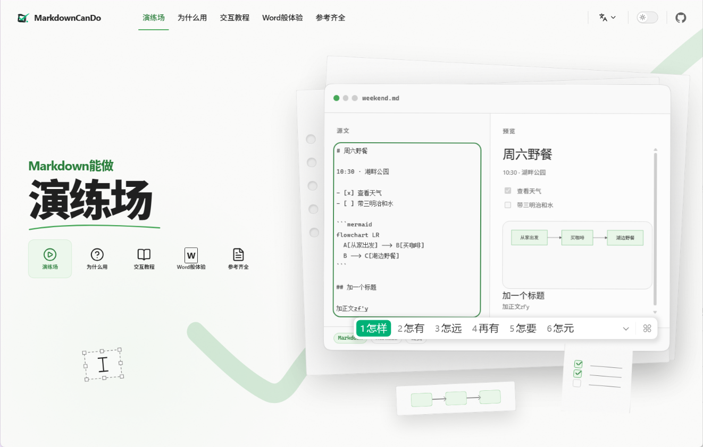

# MarkdownCanDo

[](https://markdown.aicando.xyz/tutorial/)[](https://markdown.aicando.xyz/)

MarkdownCanDo 是一个用于学习、编写和探索 Markdown 能力的交互式网站。



## 本地开发

需要 Node.js 20 或更高版本，以及 pnpm 10。

```bash
pnpm install
pnpm dev
```

开发命令会自行检测端口冲突，并自动选择下一个可用端口。

构建并预览生产版本：

```bash
pnpm build
pnpm preview
```

## Cloudflare 部署

生产站使用 Cloudflare Worker Static Assets，并通过私有 R2 桶与 SQLite Durable Object 提供临时图片上传。部署派生项目之前，请先检查 `wrangler.jsonc` 中的自定义域名和 `IMAGE_*` 限额。

首次部署需要创建私有的 Standard 桶 `markdown-can-do-uploads`，保持 `r2.dev` 与公开自定义域名关闭，并为 `uploads/` 配置 1 天生命周期。完整命令、限额依据、防盗链验证和监控方法见 [Cloudflare 图片上传部署教程](../docs/cloudflare-image-upload.md)。

```bash
pnpm test
pnpm typecheck
pnpm cloudflare:deploy:dry
pnpm cloudflare:deploy
```

旧域名重定向由 `wrangler.redirect.jsonc` 单独维护。

## 技术栈

- VitePress 与 Vue
- Milkdown Crepe 所见即所得编辑器
- markdown-it 与 DOMPurify 渲染及清理 Markdown
- Mermaid、KaTeX 与 ABCJS 扩展内容
- Cloudflare Workers Static Assets
- Cloudflare R2 私有图片存储与 Durable Object 配额

## 翻译说明

中文是主要版本。文案更新后，需要同步检查英语和葡萄牙语内容。

## 版本状态

v0.9 是 1.0 之前的预发布版本。主要体验已经可以部署和使用；在 v1.0 之前仍会继续完善内容覆盖、无障碍、包体积和编辑器兼容性。
