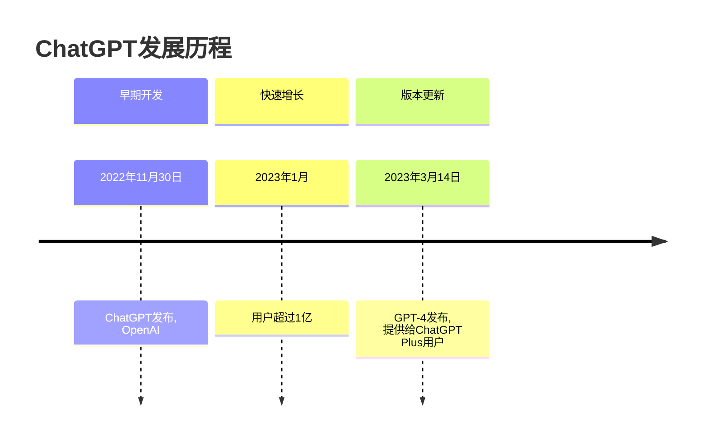

# 让 ChatGPT 写 Markdown

## 全让它写

比如本站的一个 TimeLine 是这样让 ChatGPT 写的：

```markdown
请参考 https://en.wikipedia.org/wiki/ChatGPT
用mermaid timeline
画出ChatGPT的发展史
```

GPT 产出：

````markdown

````

官方甚至推出了[官方 Plugin](https://www.mermaidchart.com/blog/posts/mermaid-chart-chatgpt-plugin-combines-generative-ai-and-smart-diagramming)

[//]: # (TODO：GPTs)

## 优化排版

把别人写好的规范喂给 GPTs，比如可以用阮一峰的[《中文技术文档的写作规范》](https://github.com/ruanyf/document-style-guide)。

[//]: # (TODO: GPTs )

如果你喜欢用一些社交平台，那可能会发现用户喜欢用表情，可以用这个GPTs为自己的文字加上合适的Emoji[鹦鹉GPT：🦜🦜🦜鹦鹉复读机，但是会带上表情🦜🦜🦜](https://chat.openai.com/g/g-yqvA1CiDz-parrotgpt)

### Prompt 平替

当然，如果你没有 ChatGPT 的会员，可以用 Prompt 工程替代一下。推荐的 AI 可以参考[这个链接](https://www.gantrol.com/AI/TOP1.html)

[//]: # (TODO: 对应的Prompt，从文件直接导入，折叠)
