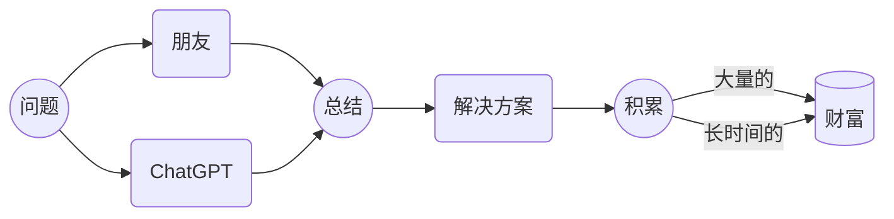

```mermaid
flowchart LR
A(("问题")) --> B(朋友)
A --> ChatGPT(ChatGPT)
B --> sum((总结))
ChatGPT --> sum
sum --> solution(解决方案)
solution --> accu((积累))
accu -->|大量的| Wealth[(财富)]
accu -->|长时间的| Wealth
```
