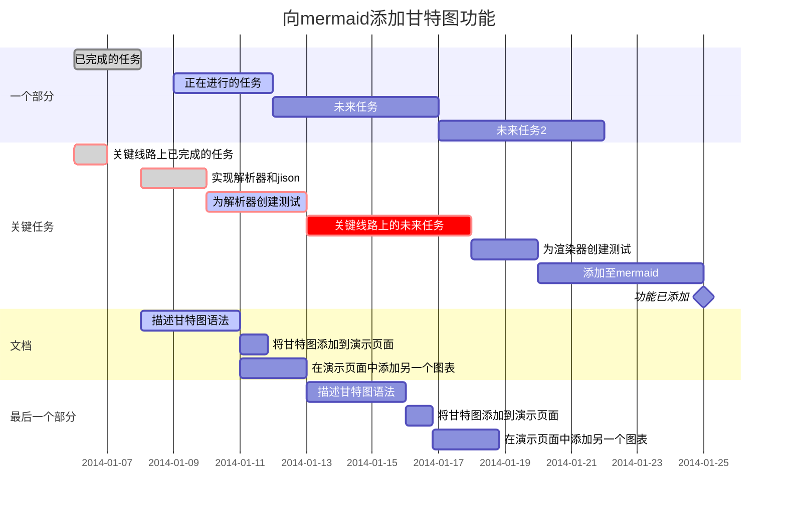

# 甘特图

## 语法

引用自 [memaid.js](https://mermaid.js.org/syntax/gantt.html#syntax)

```mermaid
gantt
    dateFormat  YYYY-MM-DD
    title       向mermaid添加甘特图功能
    excludes    周末
    %% （`excludes` 接受特定日期的YYYY-MM-DD格式，一周中的某天（例如“sunday”）或“weekends”，但不接受“weekdays”这个词。）

    section 一个部分
    已完成的任务            :done,    des1, 2014-01-06,2014-01-08
    正在进行的任务           :active,  des2, 2014-01-09, 3d
    未来任务                 :         des3, after des2, 5d
    未来任务2                :         des4, after des3, 5d

    section 关键任务
    关键线路上已完成的任务 :crit, done, 2014-01-06,24h
    实现解析器和jison      :crit, done, after des1, 2d
    为解析器创建测试       :crit, active, 3d
    关键线路上的未来任务    :crit, 5d
    为渲染器创建测试       :2d
    添加至mermaid          :until isadded
    功能已添加             :milestone, isadded, 2014-01-25, 0d

    section 文档
    描述甘特图语法         :active, a1, after des1, 3d
    将甘特图添加到演示页面  :after a1  , 20h
    在演示页面中添加另一个图表    :doc1, after a1  , 48h

    section 最后一个部分
    描述甘特图语法         :after doc1, 3d
    将甘特图添加到演示页面  :20h
    在演示页面中添加另一个图表    :48h
```
