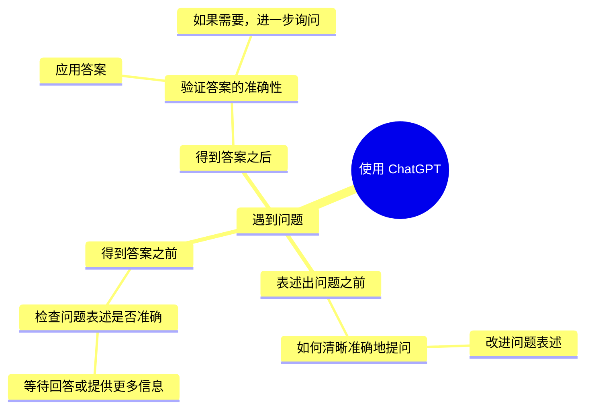

```mermaid
mindmap
  root((使用 ChatGPT))
    遇到问题
      表述出问题之前
        如何清晰准确地提问
          改进问题表述
      得到答案之前
        检查问题表述是否准确
          等待回答或提供更多信息
      得到答案之后
        验证答案的准确性
          应用答案
          如果需要，进一步询问
```
