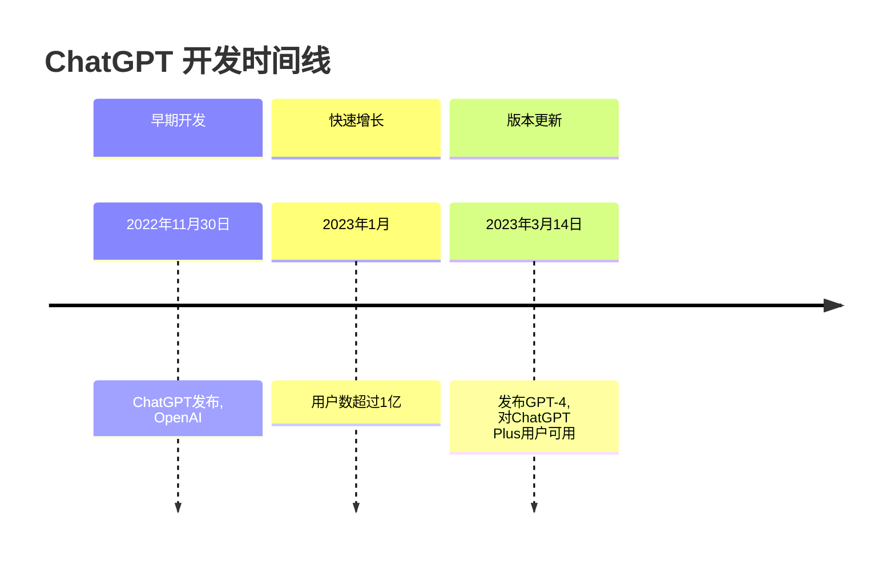

```mermaid
timeline
    title ChatGPT 开发时间线
    section 早期开发
        2022年11月30日 : ChatGPT发布, OpenAI
    section 快速增长
        2023年1月 : 用户数超过1亿
    section 版本更新
        2023年3月14日 : 发布GPT-4, 对ChatGPT Plus用户可用
```

更多信息: [时间线图 | Mermaid.js](https://mermaid.js.org/syntax/timeline.html)
